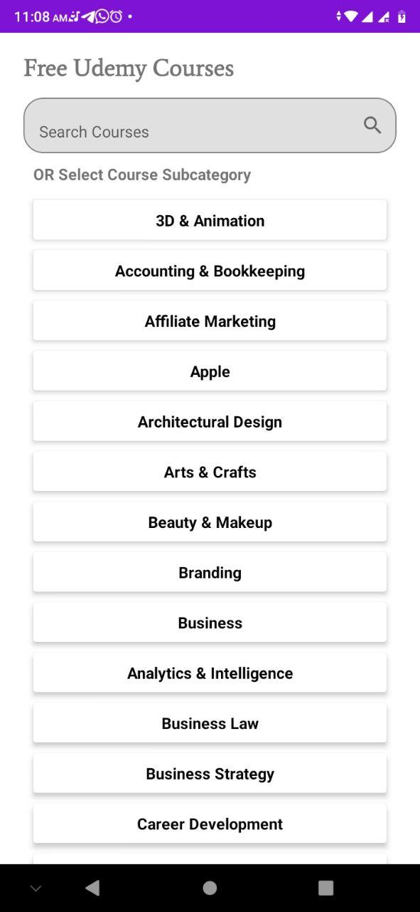
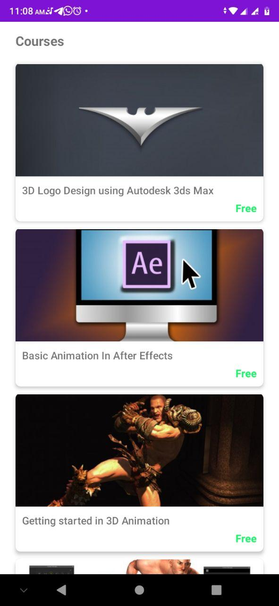
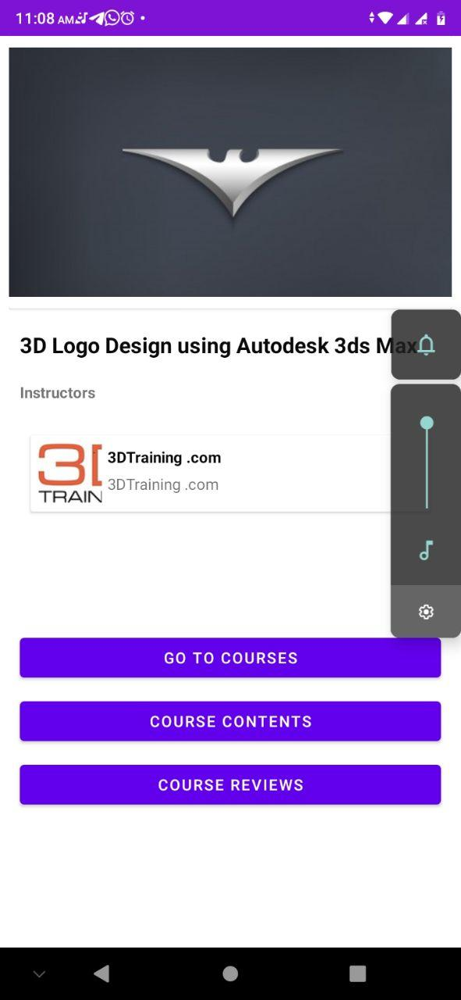
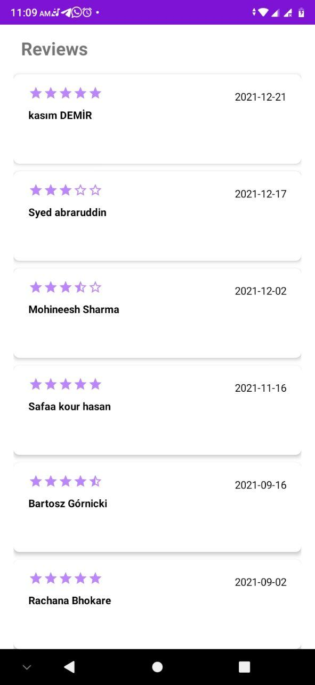
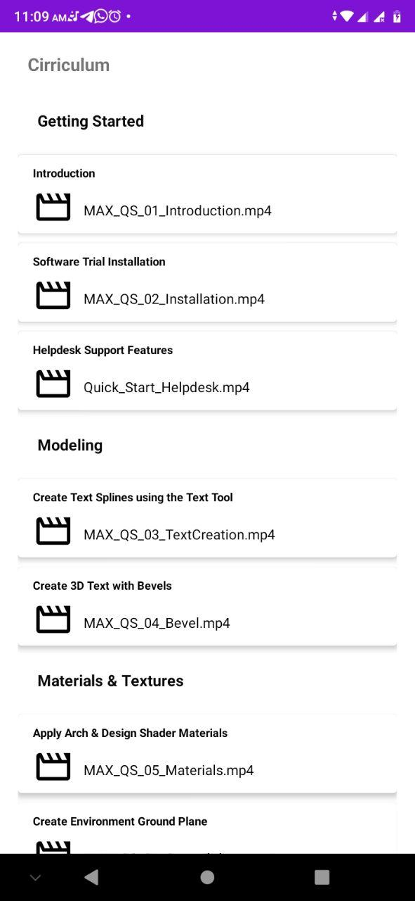

# community_project

Community Project 

 With->remote mediator 
      ->paging 3  
      ->retrofit api calls 
      ->mvvvm architecture 
      ->hilt dependency injection 
      ->room db 
      ->Jetpack navigation 
      ->View Binding 
      ->Simple web view 
     
  
  
  
  
  
